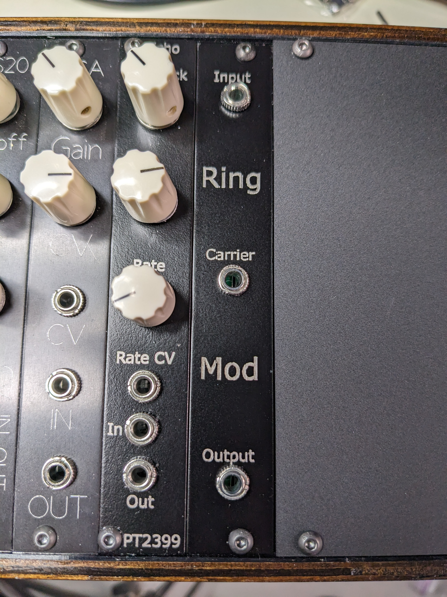
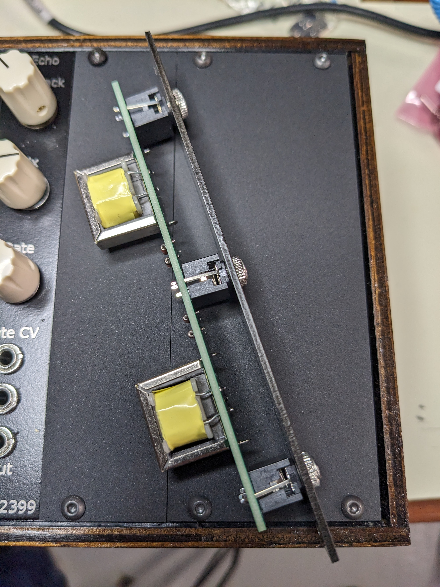

# Classic passive ring modulator

## Specs
 * 4 HP

## BOM
| Part | Quantity | Link |
|------|------|------|
| Diode (Germanium or Schottky) | 4 | |
| PJ301M or PJ-3001F (Thonkiconn) | 3 | [Tayda](https://www.taydaelectronics.com/pj-3001f-3-5-mm-mono-phone-jack.html) |
| Transformer | 2 | [ebay](https://www.ebay.com/itm/394816880166) |
